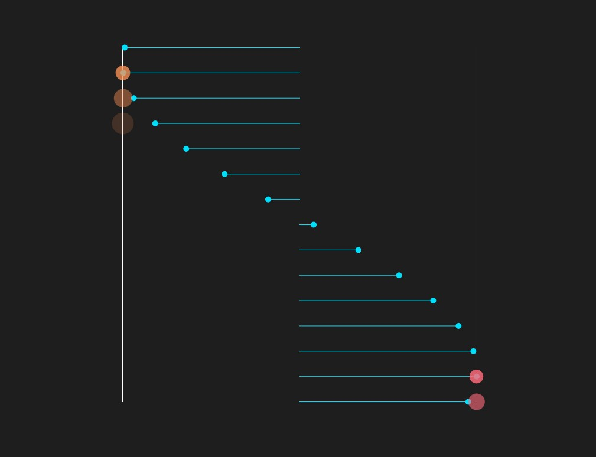

# Pendulum Wave

[Live project on Netlify](https://pendulum-wave.netlify.app/)

An audio-visual experiment featuring:

- visuals built with [p5.js](https://p5js.org/)
- web audio synthesis built with [Tone.js](https://tonejs.github.io/)
- MIDI output built with [WebMidi.js](https://webmidijs.org/)
- GUI built with [dat.gui](https://github.com/dataarts/dat.gui)

Same example on [CodePen](https://codepen.io/quentin-mckay/pen/dyVrxrE).

Originally inspired by [this youtube video](https://www.youtube.com/watch?v=JsIgubUjTck&ab_channel=TedO).

## Usage Notes

### MIDI ###
- left side notes output on MIDI channel 1
- right side notes output on MIDI channel 2
- **scale** is defined in semitones from the **root** and is mapped from bottom to top along the left and right sides. The number of octaves depends on **number of balls**.  For example, a 5 note scale with 15 balls will span 3 octaves.
- Press <kbd>h</kbd> to toggle GUI